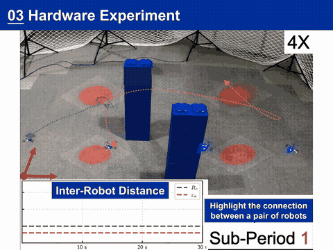

# A Probabilistic Measure of Multi-Robot Connectivity and Ergodic Optimal Control

## Overview
<!--  -->
By optimizing the proposed probabilistic connectivity measure, robots maintain intermittent connectivity during ergodic search.
<div align="center">

</div>

## Installation  

### Conda Environment Setup  
```bash
# Clone repository  
git clone https://github.com/rap-lab-org/public_pymec  
cd public_pymec 

# Create and activate conda environment (Python 3.12 recommended)  
# Note that the results may vary slightly due to the version of JAX
conda env create -f imec.yml -n imec
conda activate imec  
```
---

## Example  

Refer to **[imec.ipynb](./imec.ipynb)** and **[baseline.ipynb](./baseline.ipynb)** for tutorial.  

---

## Citation  

```bibtex
@article{liu2025probabilistic,
    title={A Probabilistic Measure of Multi-Robot Connectivity and Ergodic Optimal Control}, 
    author={Yongce Liu, Zhongqiang Ren},
    journal={RSS},
    year={2025},
}
```

---

## Acknowledgement  

This project builds upon the following works:  

### iLQR Implementation  

- Paper: [Fast Ergodic Search With Kernel Functions](https://ieeexplore.ieee.org/document/10891753)
- GitHub Repository:
[ergodic-control-sandbox: https://github.com/MurpheyLab/ergodic-control-sandbox](https://github.com/MurpheyLab/ergodic-control-sandbox)  
- The codebase was optimized with JAX's computational primitives for improved performance and simplicity.

### Time-Optimal Ergodic Search  

- Paper: [Time-optimal ergodic search: Multiscale coverage in minimum time](https://journals.sagepub.com/doi/abs/10.1177/02783649241273597) 
- GitHub Repository: [time_optimal_ergodic_search](https://github.com/ialab-yale/time_optimal_ergodic_search)  

<!-- ## Note
jax[cpu] and jax[gpu], results may be different. -->